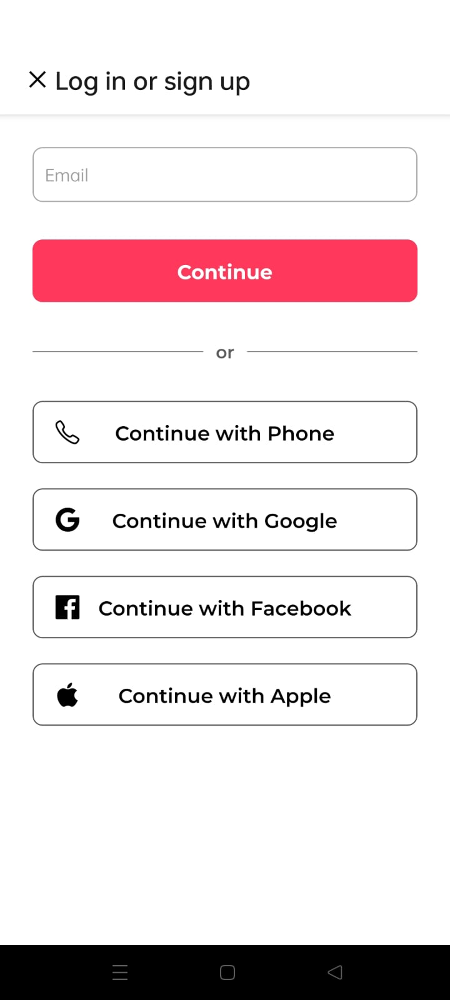
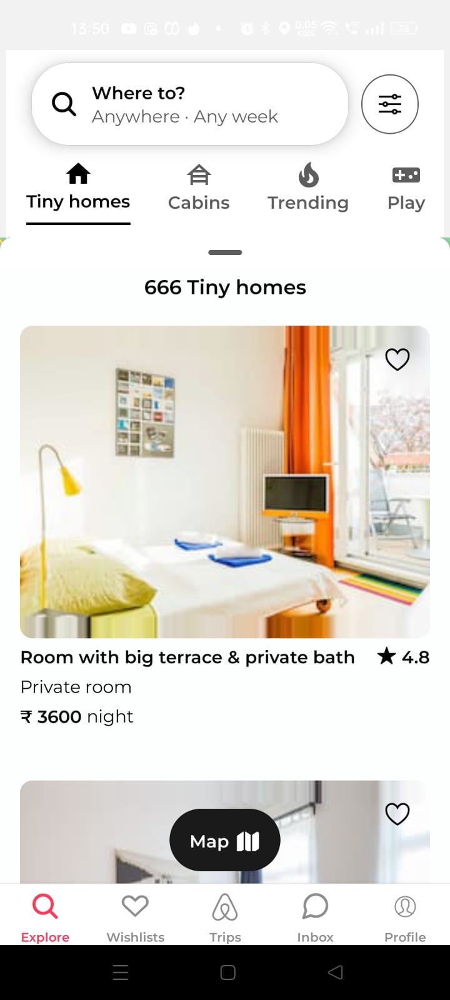
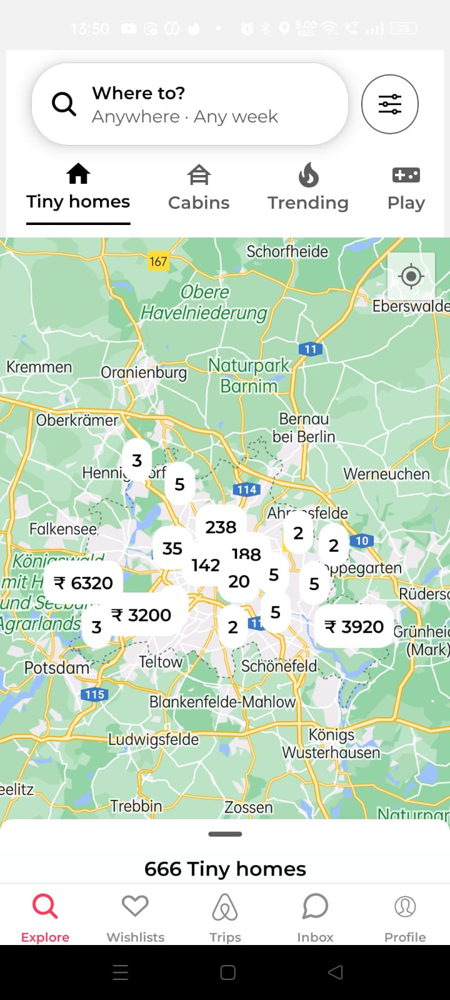
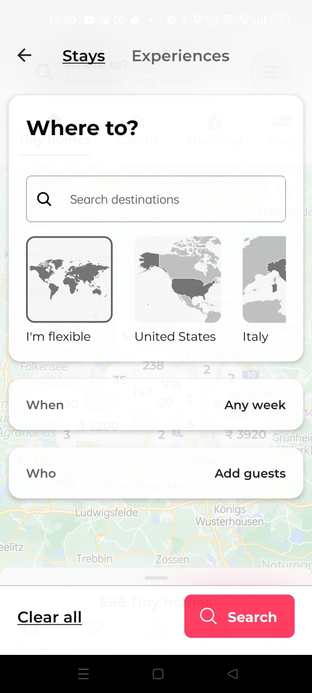
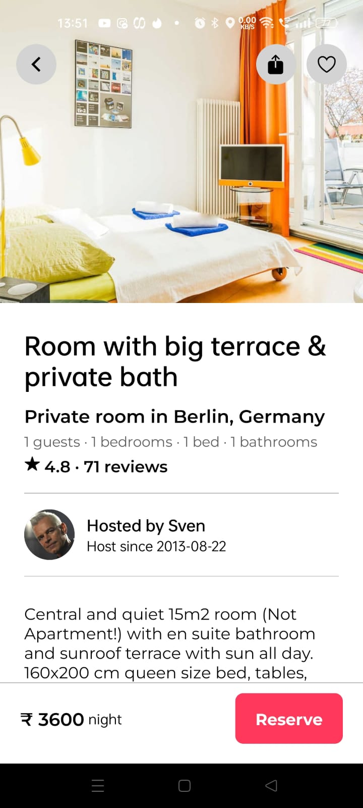

# React Native AirBnB Clone with Clerk

This is a React Native AirBnB clone using Clerk for user authentication.

Additional features:

- [Expo Router] file-based navigation
- [Google] [Facebook] & [Apple] Auth with Clerk
- [Reanimated 3] for animations
- [MapView] with Marker and [Clustering]
- [Bottom Sheet]
- Modal with Animations and Blurred Background

## Screenshots

